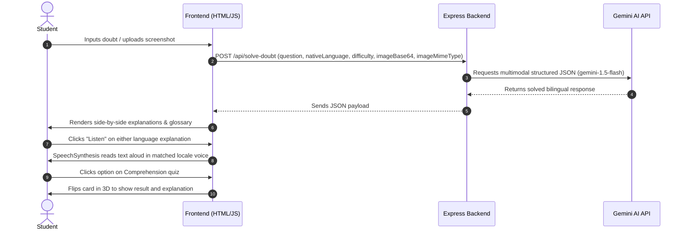

# Project Report: Doubtless AI

## 1. Application Overview & Tech Stack
**Doubtless AI** is a centered, multimodal academic doubt solver designed to assist regional and international students transitioning to English-medium campus environments. By submitting doubts as text or images, students receive side-by-side explanations in English and a chosen native language (such as Hindi, Tamil, or Kannada).

### Technology Stack
* **Frontend**: Vanilla HTML5, CSS3, JavaScript (ES6+). Styled using a centered hero panel, glassmorphism, responsive columns, and drifting glow animation blobs. Uses Google Fonts (`Space Grotesk`, `Newsreader`, `Instrument Serif`) and FontAwesome.
* **Backend**: Node.js and Express. Handles API endpoints for solving doubts (configured for base64 image decoding) and static file serving.
* **AI Model**: Google Gemini API (`gemini-1.5-flash` model) via the official Node.js SDK.
* **APIs Used**: Browser Web Speech API for voice dictation (Speech-to-Text) and speech synthesis (Text-to-Speech).

---

## 2. Prompting Strategy & Frameworks
Doubtless AI relies on structured JSON responses to feed its dual-column layout, glossary, and interactive quiz.

### Multimodal JSON Extraction Prompt
```text
You are "Doubtless AI", a premier centered bilingual academic tutor for college students.
The student has submitted a doubt.
[STUDENT QUESTION TEXT]
[ATTACHED IMAGE PROBLEM]

Please solve this doubt and provide an explanation under these parameters:
1. Native Language/Locale: "[LANGUAGE]"
2. Difficulty/Level: "[DIFFICULTY]"

Respond with ONLY a JSON object matching this schema:
{
  "englishExplanation": "A detailed explanation in English using markdown formatting. If Advanced, include mathematical equations in LaTeX style.",
  "nativeExplanation": "The matching translation and explanation in [LANGUAGE]. Ensure it reads naturally but keeps key English technical terms in brackets next to native words.",
  "keyTerms": [
    {
      "term": "English technical term",
      "nativeTranslation": "Translation in [LANGUAGE]",
      "definition": "A short, easy-to-remember definition in English"
    }
  ],
  "quiz": [
    {
      "question": "A multiple choice question testing understanding.",
      "options": ["A) ...", "B) ...", "C) ...", "D) ..."],
      "correctAnswer": "A",
      "explanation": "Brief explanation of why the correct option is right."
    }
  ]
}
```

---

## 3. Application Architecture
The following diagram outlines the key component interactions:



---

## 4. Key Interactive Elements & Animations
1. **Drifting Glow Backdrops**: Fixed position blur circles that slowly drift in the background using CSS keyframes, giving a premium glassmorphic atmosphere.
2. **Centered Search Console**: A centered card with attachment actions, voice buttons, and dynamic image previews.
3. **3D Quiz Flip Cards**: Cards containing quiz questions flip 180 degrees using CSS 3D transforms (`transform-style: preserve-3d`) to show correct/incorrect answers and detailed feedback when an option is selected.
4. **Active Speech visual wave**: A bouncing 5-bar voice wave indicator that animates when Speech Recognition is active.
5. **Smart Text-to-Speech (TTS)**: Web Speech Synthesis reads the generated explanations aloud, dynamically matching the voice language to regional Indian scripts (like Hindi, Tamil, Kannada) or English.
6. **Voice Dictation (STT)**: Enables speech dictation in the user's selected language using the browser Web Speech API.
7. **Theme Engine**: Complete styling variables for Light Mode and Dark Mode saved inside LocalStorage.
